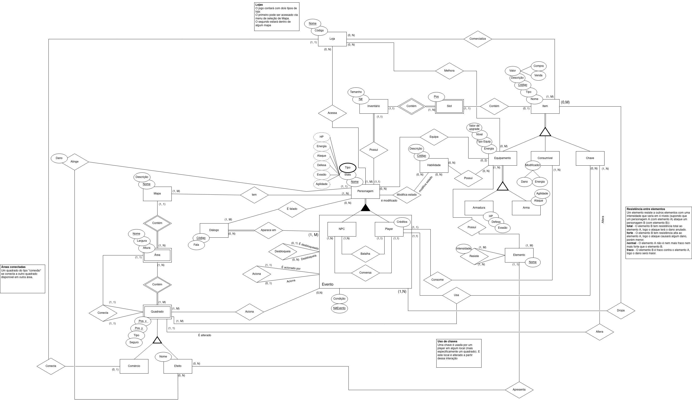
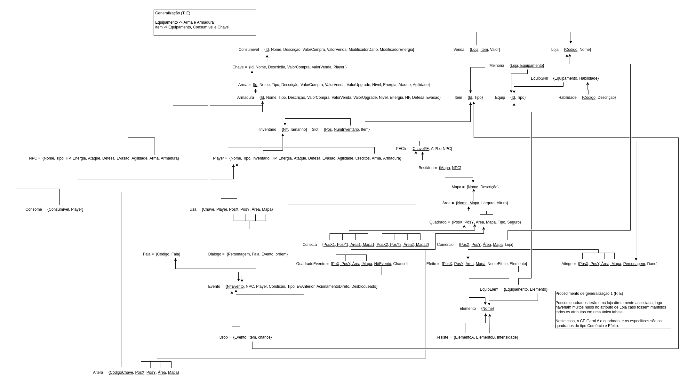
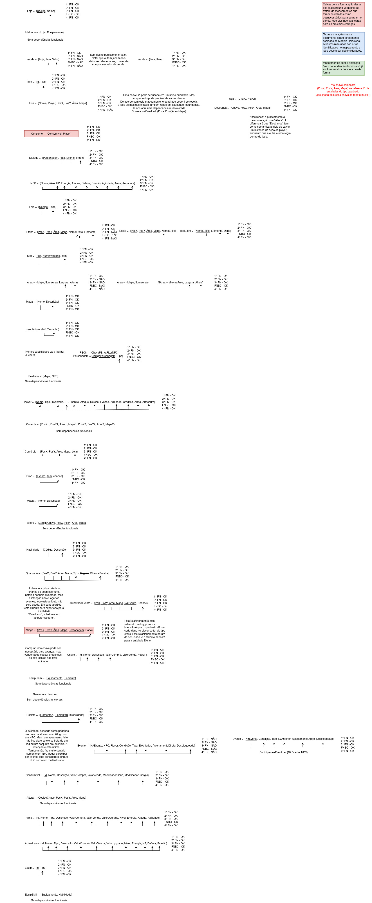

# Grupo 03 - Megaman

Repositório para o desenvolvimento do projeto de Megaman, do Grupo 3, na disciplina SBD1 com o professor Maurício Serrano.

    

## Colaboradores

| Nome | Matrícula |
|----|------------|
| [Ailton Aires Amado](https://github.com/ailtonaires) | 18/0011600 |
| [André Lucas](https://github.com/andrelucasf) | 15/0005563 |
| [Daniel Primo](https://github.com/danieldagerom) | 18/0063162 |
| [Igor Aragão](https://github.com/roginaldosemog) | 15/0011903|
| [Wagner M Cunha](https://github.com/wagnermc506) | 18/0029177 |

## Entrega Módulo 1 - Modelo Entidade Relacionamento (MER)

Abaixo a última versão do diagrama do Modelo Entidade Relacionamento (v1.0). Todas as versões podem ser encontradas na pasta [MER](./MER).

    

## Entrega Módulo 2 - Modelo Relacional (MR)

Abaixo a última versão do diagrama do Modelo Relacional (v1.0). Todas as versões podem ser encontradas na pasta [Modelo Relacional](./Modelo_Relacional).
O Modelo Entidade Relacionamento também foi atualizado, e esta entrega usa como base o [MER Versão 1.2](./MER/MER_megaman_mud_v1.2.jpg).

    

## Entrega Módulo 3 - Normalização

Abaixo a última versão do documento de Normalização (v1.0). As outras versões podem ser encontradas na pasta [Normalizacao](./Normalizacao).

    

## Entrega Módulo 4 - SQL

Este módulo tem como entregáveis:

- O arquivo de [criação de tabelas](SQL/TableCreation.sql);
- O arquivo de [inserção de tuplas](SQL/TuplasCreation.sql); e
- A [implementação inicial do jogo](game).

